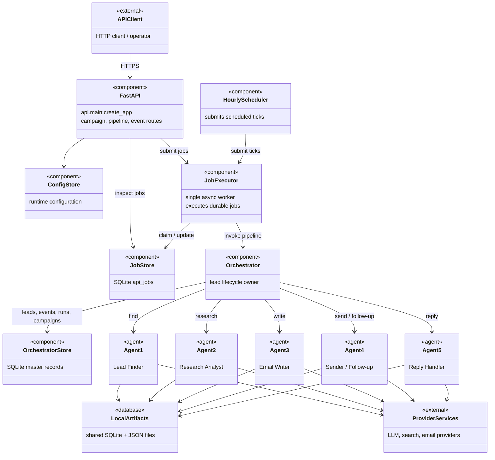
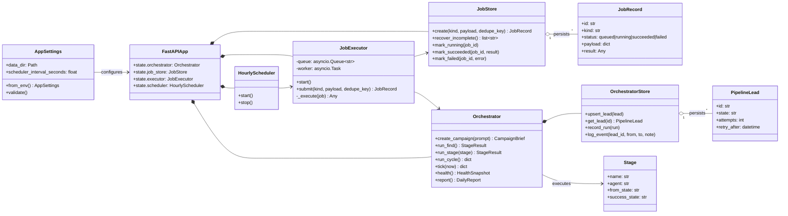
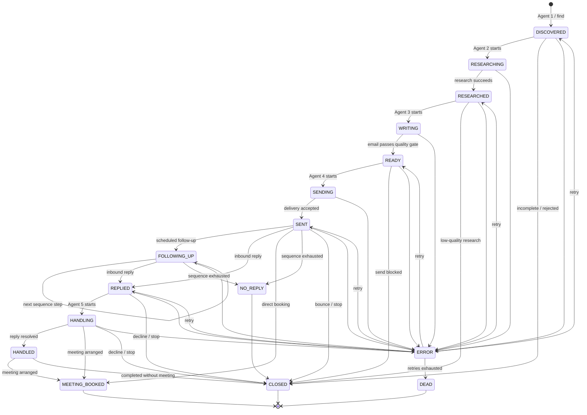

# AutoReach System Architecture — UML Diagrams

These diagrams describe the implemented single-instance MVP. The API is a
control plane; all long-running work is persisted as jobs and executed by one
worker because the orchestration and agent integrations share local SQLite and
file-based artifacts.

## 1. Deployment and component diagram



## 2. Runtime class diagram



## 3. Pipeline job sequence diagram

```mermaid
sequenceDiagram
    autonumber
    actor Operator
    participant API as FastAPI API
    participant Jobs as JobStore (SQLite)
    participant Worker as JobExecutor
    participant Orchestrator
    participant Store as OrchestratorStore
    participant Agent as Stage adapter / agent

    Operator->>API: POST pipeline or campaign endpoint
    API->>Jobs: create queued JobRecord
    API->>Worker: submit(job id)
    Worker->>Jobs: mark_running(job id)
    Worker->>Orchestrator: run_find(), run_stage(), run_cycle(), or tick()
    Orchestrator->>Store: read campaign and eligible leads
    Orchestrator->>Agent: ingest() and execute(stage context)
    Agent-->>Orchestrator: StageResult + outcomes
    Orchestrator->>Store: persist lead transitions and run history
    Orchestrator-->>Worker: result
    Worker->>Jobs: mark_succeeded(job id, result)
    API-->>Operator: 202 / job reference; GET job for outcome

    Note over Worker,Jobs: On restart, queued and running jobs are requeued.
    Note over Worker,Agent: One worker protects shared local agent artifacts.
```

## 4. Lead lifecycle state diagram



## Source map

- API lifecycle and dependency wiring: `api/main.py`
- Durable single-consumer execution: `api/executor.py`, `api/jobs.py`, and `api/scheduler.py`
- Master pipeline coordination: `orchestrator/orchestrator.py`
- State and stage contracts: `orchestrator/state_machine.py`
- Live-agent integration boundary: `orchestrator/adapters/live.py`
